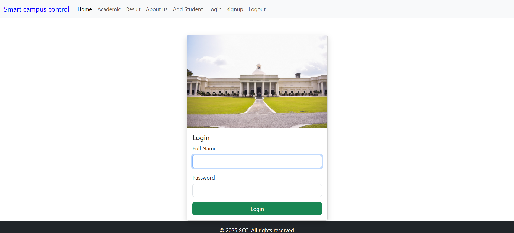

# 📘 SMART CAMPUS CONTROL- YOUR ACADEMIC COMPANION

Welcome to SMART CAMPUS CONTROL, the ultimate platform where students can easily access and contribute:

- CLASS NOTES  
- PREVIOUS YEAR QUESTION PAPERS (PYQs)

Whether you're prepping for exams or just revising, SMART CAMPUS CONTROL is designed to help you study smarter, not harder.

Run Live -https://smart-campus-control.onrender.com/
---

## 🚀 FEATURES

### 🔍 ACCESS NOTES & PYQs
- Browse well-organized notes and previous year question papers across subjects and semesters.
- Filter by subject, semester, or year for quick results.

### 📤 CONTRIBUTE CONTENT
- Share your handwritten notes, typed summaries, or question papers with others.
- All contributions are credited to the uploader, helping you build a strong learning community.

### 🧠 SMART SEARCH
- Built-in intelligent search lets you find the right content in seconds.

### 🔒 ACCOUNT SYSTEM
- Sign up or log in to manage your uploads and saved resources.

### 📈 MOST VIEWED & TRENDING
- Discover the most downloaded PYQs and notes — let the crowd guide your studies.

---

## 🌟 WHY USE SMART CAMPUS CONTROL?

FOCUSED ON WHAT MATTERS  
SMART is built for academic success — clean, focused, and free from distractions or ads.

POWERED BY STUDENTS  
A community-driven resource hub with relevant and real-world study materials.

TIME-SAVING  
Stop digging through chats or drives. Everything is just a search away.

---

## ✨ SNEAK PEEK

  
COMING SOON: 
1. View Student details
2. Faculty Information
3. Dark Mode

---

## 🛠️ TECH STACK

- Frontend: React.js 
- Backend: Node.js / Express  
- Database: MongoDB  
<!-- - File Storage: Firebase or AWS S3   -->
- Authentication: JWT and PassportJs

---

## 💡 HOW TO USE

```bash
# Clone the repository
git clone https://github.com/Shaiksufiyan157/smart-campus-control.git

# Go into the project directory
cd smart campus control

# Install dependencies
npm install

# Run the app locally
npm run dev
